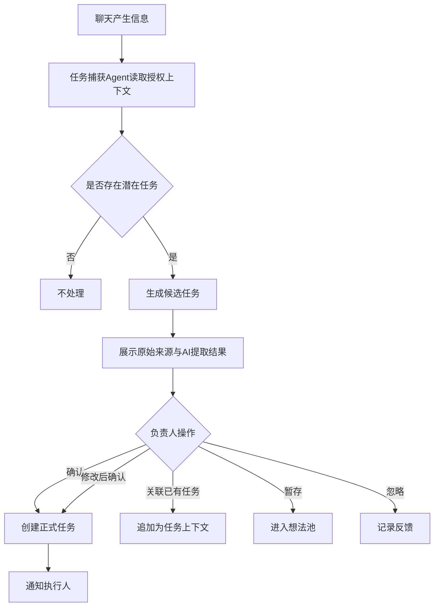
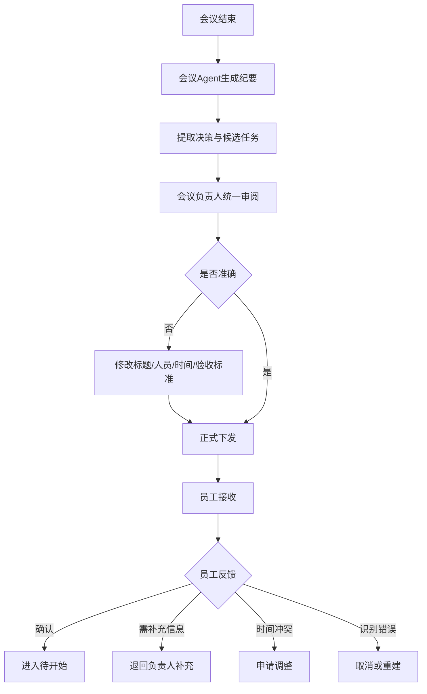
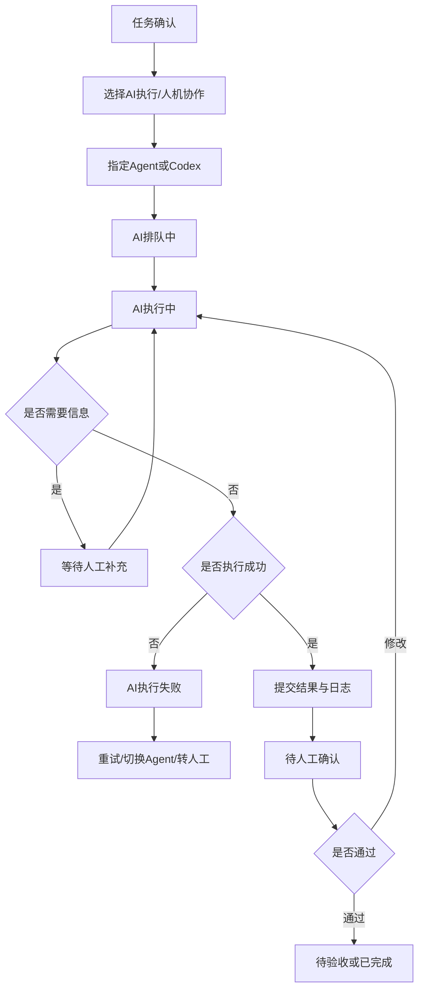
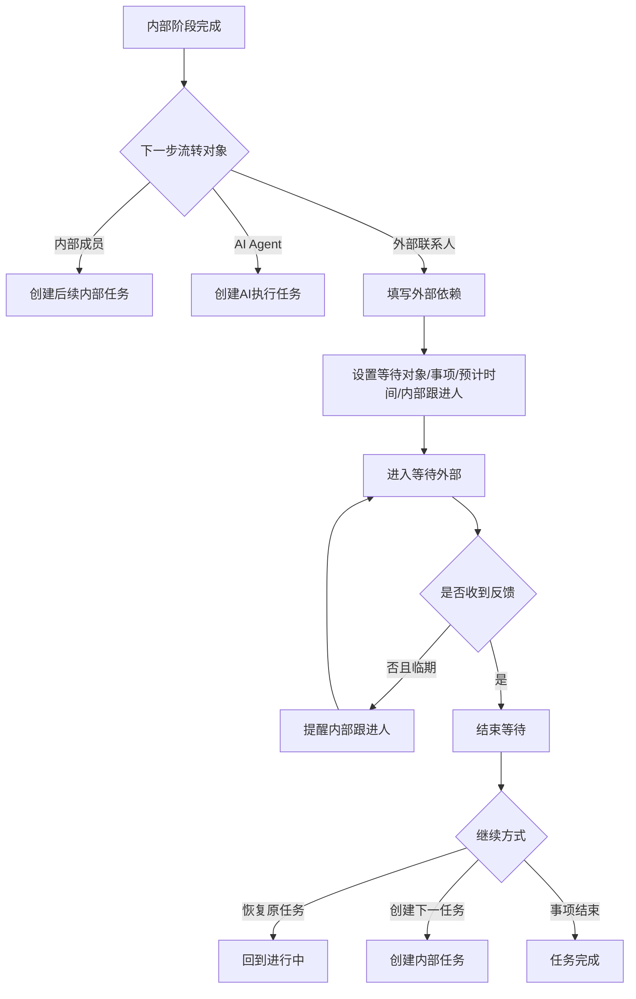
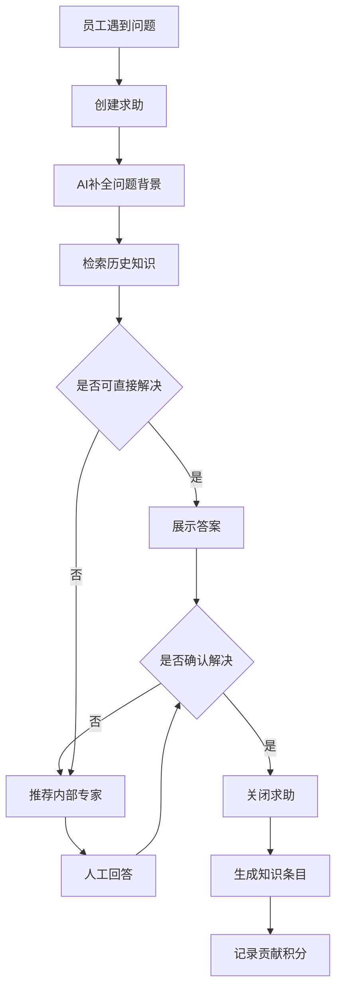

# 全意 AI Task OS｜核心用户流程 V1.0

## 1. 聊天自动拾取任务

```mermaid
flowchart TD
A[聊天产生信息] --> B[任务捕获Agent读取授权上下文]
B --> C{是否存在潜在任务}
C -- 否 --> D[不处理]
C -- 是 --> E[生成候选任务]
E --> F[展示原始来源与AI提取结果]
F --> G{负责人操作}
G -- 确认 --> H[创建正式任务]
G -- 修改后确认 --> H
G -- 关联已有任务 --> I[追加为任务上下文]
G -- 暂存 --> J[进入想法池]
G -- 忽略 --> K[记录反馈]
H --> L[通知执行人]
```

## 2. 会议纪要转任务

```mermaid
flowchart TD
A[会议结束] --> B[会议Agent生成纪要]
B --> C[提取决策与候选任务]
C --> D[会议负责人统一审阅]
D --> E{是否准确}
E -- 否 --> F[修改标题/人员/时间/验收标准]
F --> G[正式下发]
E -- 是 --> G
G --> H[员工接收]
H --> I{员工反馈}
I -- 确认 --> J[进入待开始]
I -- 需补充信息 --> K[退回负责人补充]
I -- 时间冲突 --> L[申请调整]
I -- 识别错误 --> M[取消或重建]
```

## 3. AI执行任务

```mermaid
flowchart TD
A[任务确认] --> B[选择AI执行/人机协作]
B --> C[指定Agent或Codex]
C --> D[AI排队中]
D --> E[AI执行中]
E --> F{是否需要信息}
F -- 是 --> G[等待人工补充]
G --> E
F -- 否 --> H{是否执行成功}
H -- 否 --> I[AI执行失败]
I --> J[重试/切换Agent/转人工]
H -- 是 --> K[提交结果与日志]
K --> L[待人工确认]
L --> M{是否通过}
M -- 通过 --> N[待验收或已完成]
M -- 修改 --> E
```

## 4. 内部任务转等待外部

```mermaid
flowchart TD
A[内部阶段完成] --> B{下一步流转对象}
B -- 内部成员 --> C[创建后续内部任务]
B -- AI Agent --> D[创建AI执行任务]
B -- 外部联系人 --> E[填写外部依赖]
E --> F[设置等待对象/事项/预计时间/内部跟进人]
F --> G[进入等待外部]
G --> H{是否收到反馈}
H -- 否且临期 --> I[提醒内部跟进人]
I --> G
H -- 是 --> J[结束等待]
J --> K{继续方式}
K -- 恢复原任务 --> L[回到进行中]
K -- 创建下一任务 --> M[创建内部任务]
K -- 事项结束 --> N[任务完成]
```

## 5. 求助与知识沉淀

```mermaid
flowchart TD
A[员工遇到问题] --> B[创建求助]
B --> C[AI补全问题背景]
C --> D[检索历史知识]
D --> E{是否可直接解决}
E -- 是 --> F[展示答案]
F --> G{是否确认解决}
G -- 是 --> H[关闭求助]
G -- 否 --> I[推荐内部专家]
E -- 否 --> I
I --> J[人工回答]
J --> G
H --> K[生成知识条目]
K --> L[记录贡献积分]
```
